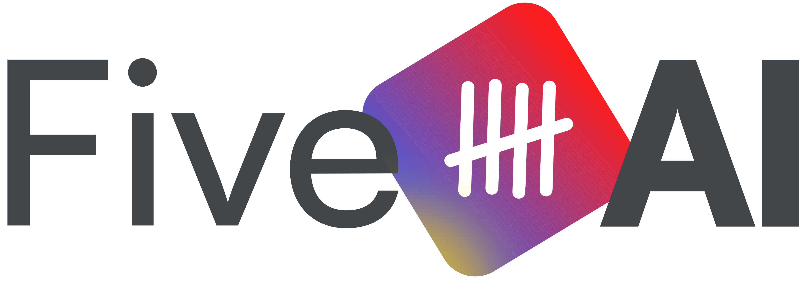

# 🚀 Five AI — Career Co-Pilot

### ✨ One daily action. Compounding career advantage.

[](http://fiveai.co)
[](http://fiveai.co)
[](mailto:team@fiveai.co)

[](http://fiveai.co)

---

## 🌟 Vision

> **Empower professionals to take charge of their careers with personalized, AI-driven support that fits seamlessly into their busy lives.**

Most professionals know they should invest in their careers. Few do — because traditional advice is overwhelming, generic, and disconnected from real life. Five changes that. We deliver one personalized micro-action per day that compounds into visible career breakthroughs.

---

## ⚡ What Makes Five AI Special

| | |
|---|---|
| 🎯 **5-Minute Transformation** | Turn career growth into one simple daily action that creates lasting impact without overwhelming your schedule. |
| 🧠 **AI That Knows You** | Your personal career coach that remembers your history, learns your style, and adapts to your unique professional journey. |
| 🏆 **Proven Results** | Deliver **3 visible wins in your first 7 days** with our scientifically-designed momentum system. |
| 🔒 **Privacy-First** | Your data stays yours. Full transparency, complete control, and the ability to delete everything anytime. |

---

## 💡 Why Five AI

**Five empowers professionals to take control of their career journeys through personalized, AI-driven guidance that fits seamlessly into busy lives.**

| Feature | Description | Impact |
|---------|-------------|--------|
| 💡 **Daily Nudges** | 5-minute micro-actions for confidence and networking | Create lasting change without overwhelming your schedule |
| 🤖 **AI Career Coach** | Contextual executive coaching with long-term memory | 24/7 support for high-stakes career moments |
| 🎯 **Smart Goal Setting** | Co-designed wins aligned with your aspirations | 3 visible wins in your first 7 days |
| 📊 **Progress Vault** | Track achievements and build your career story | Build a visible record for performance reviews |
| ⚡ **AI Power Tools** | Resume optimizer, outreach builder, communication enhancer | Amplify your professional impact instantly |

### 🎯 Perfect For

| Challenge | Five AI Solution |
|-----------|------------------|
| 👁️ **"My work goes unnoticed"** | Get visibility with strategic positioning and communication tools |
| 🔄 **"I feel stuck in my role"** | Break plateaus with personalized advancement roadmaps |
| 🤝 **"I lack the right connections"** | Build meaningful relationships through guided networking |
| 🗣️ **"I struggle to speak up"** | Gain confidence with practice scenarios and impact frameworks |
| 🤖 **"AI is moving too fast"** | Master AI tools with curated, practical applications |

### 🚀 The Five AI Advantage

> **Why settle for generic career advice when you can have a personalized co-pilot?**

- ✨ **Sounds Like You** — AI that matches your voice and professional style
- ⚡ **Micro-Momentum** — 5 minutes daily beats overwhelming intensity
- 🔐 **Your Data, Your Control** — Complete transparency and ownership
- 📈 **Measurable Wins** — Track real progress, not just feel-good metrics

---

## 🧠 Our Philosophy

> *"Small daily actions compound into career breakthroughs"*

| Principle | What It Means |
|-----------|---------------|
| ⏰ **5 Minutes = Transformation** | Meaningful change doesn't require overwhelming time investment |
| 🎮 **AI as Superpower** | Technology should feel like a cheat code, not another tool |
| 🧘 **Calm & Intelligent** | Career growth through serenity, not stress |
| 🔄 **Compound Effect** | Nudges + Tools + Community = Career Acceleration |
| 🌐 **Network Effects** | Success multiplies when shared with others |

---

## 🏗️ The Platform

### 🤖 AI Career Coach

A conversational AI coach that doesn't just respond — it *remembers*. Every interaction builds on the last. It knows your goals, your communication style, your wins, and your pain points. Context-aware coaching for high-stakes moments: negotiations, performance reviews, difficult conversations, career pivots.

- 🧠 Long-term memory across conversations
- 🎯 Intent-aware routing to specialized coaching modes
- ⚡ Streaming responses with real-time evaluation
- ✅ Coaching quality verification built in

### 📚 Personalized Learning Engine

Not a course library. A living system that adapts to how you learn, what you need, and where you are in your career.

| Feature | What It Does |
|---------|-------------|
| 📋 **Learning Plans** | Curated paths aligned to your goals — not generic career tracks |
| 💡 **Daily Nudges** | 5-minute micro-actions that build confidence, visibility, and skills |
| 📖 **Lessons & Hacks** | Practical frameworks for real workplace challenges |
| 💬 **Tips & Tidbits** | Bite-sized insights delivered when you need them |
| 📝 **Assessments** | Measure growth, identify gaps, calibrate your path |
| 🪞 **Reflections** | Weekly prompts that turn experience into wisdom |
| 🎯 **Personal Goals** | Set, track, and achieve milestones with AI support |

### 🏆 Gamification & Progress

Career growth should feel rewarding, not exhausting.

- 🔥 **Streaks** — Build momentum with daily consistency (with freeze protection)
- 🏅 **Achievements** — Unlock badges and levels as you grow
- 📊 **Points & Leaderboards** — See where you stand, celebrate progress
- 📁 **Progress Vault** — A living record of wins for performance reviews and interviews

### 🧩 AI Power Tools

Built-in intelligence that goes beyond chat.

**🤖 Agent Architecture** — Not a single chatbot. A network of specialized AI agents that collaborate:

| Agent | Role |
|-------|------|
| 🎙️ **Coaching Agent** | Primary conversational coach — intent routing, context-aware responses, streaming |
| 🔍 **Evaluation Agent** | Monitors coaching quality in real-time, scores and verifies every interaction |
| 💡 **Nudge Agent** | Generates personalized daily micro-actions based on your goals and history |
| 💎 **Tidbit Agent** | Delivers context-relevant career insights at the right moment |
| 🗺️ **Journey Agent** | Summarizes your progress, identifies patterns, generates career narratives |
| ✅ **Verification Agent** | Cross-checks AI outputs for accuracy, relevance, and safety |

**📋 Plan & Execute Model** — Every coaching interaction follows a structured flow:

```
User Input → Intent Classification → Agent Selection → Plan Generation
    → Sub-Agent Execution → Quality Verification → Response Delivery
```

- 🧩 Agents decompose complex career questions into sub-tasks
- ⚙️ Each sub-agent specializes (search, generate, evaluate, summarize)
- 🛡️ Results are verified before delivery — no hallucinated career advice
- 💾 Full conversation context preserved across sessions

**🔧 AI Infrastructure:**

- 🔍 **Smart Search** — Semantic vector search across skills, wins, pain points, and career knowledge
- 🕸️ **Context Graph** — Your career knowledge mapped as an interconnected graph with relationships
- 📝 **Prompt Library** — Tested, versioned, A/B-tested prompts for every coaching scenario
- 🔗 **MCP Integration** — Model Context Protocol tools connecting profile, learning, and conversation data
- 🛡️ **PII Detection** — Automatic detection and filtering of sensitive information
- 🔒 **Injection Protection** — Prompt injection detection and mitigation built in

### 👥 Community & Engagement

Career growth multiplies when shared.

- 💬 **Posts & Discussions** — Share insights, ask questions, celebrate wins
- 👥 **Groups & Events** — Join communities aligned to your career stage
- 🛡️ **Moderation** — Safe, professional space with built-in reporting

### 💳 Subscription & Payments

Flexible plans for individuals and enterprises.

- 📦 **Tiered Plans** — Free, Pro, Enterprise with usage-based metering
- 💰 **Multiple Gateways** — Stripe, PayPal, Razorpay support
- 🤝 **Affiliate Program** — Referral tracking, commissions, invoicing
- 📊 **Enterprise Monitoring** — Usage dashboards for organizations

### 🔔 Notifications

Stay engaged without being overwhelmed.

- 📱 **Multi-Channel** — Email, SMS, WhatsApp, Push (configurable)
- ✉️ **Smart Templates** — Personalized notification content
- 📈 **Delivery Analytics** — Track engagement across channels

---

## 🏛️ Architecture

**17 microservices. 2 AI engines. 1 mobile app. 1 seamless experience.**

```
     📱 Mobile App                    🌐 Web Portal
     (Expo/React Native)             (React/Vite/shadcn)
              \                         /
               \                       /
                🔀 API Gateway (Nginx)
                         |
      ┌──────────┬───────┴───────┬──────────┐
      |          |               |          |
  🔐 Auth    👤 Profile     📚 Learning  🧠 Skills
  (OAuth2)   (Onboard)      (Plans)    (Knowledge)
      |          |               |          |
      └──────────┴───────┬───────┴──────────┘
                         |
         ┌───────────────┼───────────────┐
         |               |               |
    🤖 AI Agent     🔗 MCP Server   📨 Kafka (MSK)
    (LangGraph)     (FastMCP)       (Event Streaming)
         |               |               |
    ┌────┴────┐     ┌────┴────┐    ┌────┴────┐
    |         |     |         |    |         |
  GPT-4o  Weaviate  MongoDB  S3  DLT Retry  Audit
  (LLM)  (Vectors)  (Atlas)      (Saga)    (Events)
```

### 🧱 Tech Stack

| Layer | Technology | Purpose |
|-------|-----------|---------|
| 📱 **Mobile** | Expo + React Native + NativeWind (`five-mobile-app/five-ai-coach`) | iOS & Android native app |
| 🌐 **Web** | React + Vite + TypeScript + shadcn/ui + Tailwind CSS (`five-web-portal`) | Web portal + Admin dashboard |
| 🔀 **API Gateway** | Nginx (`five-api-gateway`) | Path-based routing, single entry point |
| ⚙️ **Backend** | 15 Java Spring Boot microservices | Domain services (auth, profiles, learning, payments, etc.) |
| 🤖 **AI Agent** | Python + LangGraph + LangChain + OpenAI GPT-4o (`five-agent`) | Stateful AI coaching workflows, multi-agent orchestration |
| 🔗 **MCP Server** | Python + FastMCP + Weaviate (`five-mcp-server`) | Model Context Protocol — AI tool integration layer |
| 🍃 **Database** | MongoDB Atlas (with Atlas Search) | Primary data store + full-text search |
| ⚡ **Cache** | AWS ElastiCache (Redis) | Sessions, token blacklist, rate limiting, multi-level cache |
| 📨 **Event Streaming** | AWS MSK (Apache Kafka) | Async event processing, DLT retry sagas, audit trails |
| 🔮 **Vector DB** | Weaviate Cloud | Semantic search, similarity matching, embeddings (text-embedding-3-small) |
| 📦 **Object Storage** | AWS S3 (IRSA) | Documents, profile pictures, content assets |
| 🔐 **Auth** | OAuth2/OIDC + JWT + API Keys + RBAC | Multi-layer security with device tracking |
| 📊 **Observability** | Prometheus + Grafana + Jaeger + OpenTelemetry | Metrics, dashboards, distributed tracing |
| ☁️ **Infrastructure** | AWS EKS + Helm + Terraform | Kubernetes orchestration, IaC |

### 📨 Event-Driven Architecture (Kafka/MSK)

9 services connected via Kafka for reliable async processing:

| Pattern | Use Case |
|---------|----------|
| 🔄 **DLT Retry Saga** | Weaviate sync failures → dead letter topic → exponential backoff retry (2m→4m→8m) |
| 📋 **Outbox Pattern** | Subscription service → transactional event publishing |
| 📊 **Event Sourcing** | Conversation events, context updates, message streams |
| 🔍 **Audit Trail** | Login audit, security alerts, user activity events |
| 🔔 **Notification Fan-out** | Community events → notification-events → multi-channel delivery |

### 🤖 AI Agent Framework (LangGraph)

```
                    🎙️ User Input
                         |
                  Intent Classification
                    /    |    \
                   /     |     \
            💡 Nudge  🗣️ Coach  📊 Summary
             Agent    Agent     Agent
               |        |        |
            Search   Generate  Summarize
            (Weaviate) (GPT-4o) (Context)
               |        |        |
               └────────┼────────┘
                         |
                  ✅ Verification Agent
                         |
                  📤 Response Delivery
```

- **LangGraph** — Stateful multi-agent workflows with conditional routing
- **LangChain** — LLM abstraction, prompt templates, output parsing
- **FastMCP** — Model Context Protocol server exposing 20+ AI tools
- **Weaviate** — Vector similarity search for contextual retrieval

### 🔐 Security

- 🔑 OAuth2/OIDC authentication with JWT tokens
- 👮 Role-Based Access Control (RBAC) with granular permissions
- 🔗 API key inter-service authentication
- 📍 Device tracking and geo-anomaly detection
- 🚫 Token blacklisting and session management
- 🛡️ GDPR-compliant data handling with consent tracking
- 🔒 Encryption in transit (TLS) for all managed services

---

## 📡 Services

| Service | Port | Purpose |
|---------|------|---------|
| 🌐 five-web-portal | 80 | React frontend + Admin UI |
| 🔀 five-api-gateway | 80 | Nginx reverse proxy |
| 🔐 five-auth-service | 17990 | OAuth2/OIDC provider |
| 👤 five-user-identity-service | 17979 | Users, roles, API keys, sessions |
| 📋 five-user-profile-service | 17878 | Profiles, onboarding, preferences |
| 🤖 five-agent | 18000 | AI coaching engine (Python) |
| 🔗 five-mcp-server | 15555 | AI tool integration (Python) |
| 📚 five-learning-goal-mgmt-service | 16969 | Learning plans, lessons, nudges, goals |
| 🧠 five-skill-knowledge-mgmt-service | 16565 | Skills, occupations, pain points, wins |
| 💬 five-context-conversation-service | 19595 | Conversations, context graph |
| 📄 five-content-management-service | 18181 | Documents, surveys, media |
| 🔔 five-notification-service | 18383 | Multi-channel notifications |
| 🏆 five-feedback-service | 18686 | Gamification, achievements, ratings |
| 💳 five-subscription-service | 18989 | Plans, payments, billing |
| 💰 five-payment-gateway-service | 18787 | Payment processing |
| 📊 five-analytics-metering-service | 17070 | Usage metrics, activity tracking |
| 📝 five-prompt-service | 18585 | Prompt library, testing, versioning |
| 👥 five-community-engagement-service | 17373 | Posts, groups, events |

---

## 🟢 Status

**Beta — Live on AWS EKS**

| | |
|---|---|
| 🌐 **Web Portal** | [app.fiveai.ai](https://app.fiveai.ai) |
| 🔐 **Auth Service** | [auth.fiveai.ai](https://auth.fiveai.ai) |
| 🔀 **API Gateway** | [api.fiveai.ai](https://api.fiveai.ai) |

All 17 services deployed and running. Full managed services infrastructure:

- 🍃 MongoDB Atlas (document database)
- ⚡ AWS ElastiCache (caching + sessions)
- 📨 AWS MSK (event streaming)
- 🔮 Weaviate Cloud (vector search)
- 📦 AWS S3 (object storage)

---

## 🚀 Get Started

| | |
|---|---|
| 🌐 **Website** | [fiveai.co](http://fiveai.co) |
| 📧 **Email** | [team@fiveai.co](mailto:team@fiveai.co) |
| 🟢 **Status** | Beta — accepting early users |

---

**Built with ❤️ by Five AI**
*One action at a time. Every day. Until your career catches up with your ambition.* ✨

Copyright 2025-2026 UnboundXLabs Private Limited. All rights reserved.
